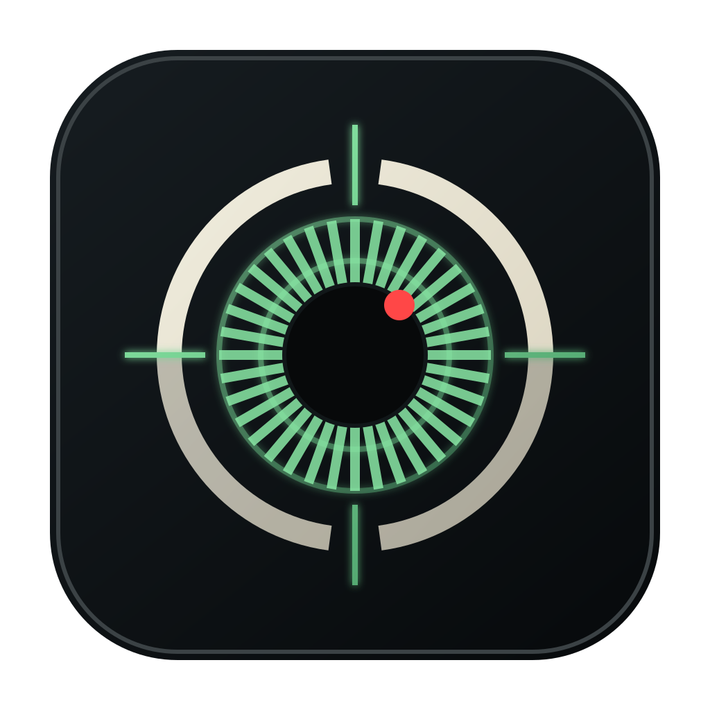

<div align="center">
  
  <h1>Aya</h1>
  <p>
    <strong>Tabbed terminal manager for coding agents.</strong><br>
    Claude Code, Codex, shells, whatever else you launch — one window, organised by project.
  </p>
</div>

<p align="center">
  
</p>

---

## What it is

Aya is a desktop app that runs real interactive PTYs (no `claude -p` headless mode — your subscription still works) and groups them by project. Each project is a directory; each project has its own set of tabs (Claude / Codex / shell / whatever you configure). The window stays a window — agents and shells stay running across project switches.

## Features

- **Real PTYs via `node-pty`** — every tab is `bash -lc 'cd <project-dir> && exec <command>'`. Login-shell PATH (mise, asdf, brew) flows through. The shipped defaults never include `-p` / `--print` / headless flags; a unit test fails the build if they do.
- **Configurable presets** — Claude Code, Codex, Aider, Gemini, OpenCode, Amp, Crush, Qwen Code, Kilo Code, Pi all auto-detected on first launch if installed. Add your own (icon + name + shell command + optional per-preset theme override) in Settings.
- **Themes** — import iTerm2 `.itermcolors` or Windows Terminal JSON; internal storage uses xterm.js's native `ITheme` shape. Switch live, no restart.
- **Search-everything (`⇧⇧` or `⌘K`)** — tokenised query matches project name, terminal name, and PTY scrollback content in parallel. AND semantics across tokens, so `ruby codex` finds the Codex terminal in your Ruby project.
- **In-pane find (`⌘F`)** — xterm.js's search addon, highlights matches inside the active terminal.
- **Drag-and-drop reorder** — project tabs and terminal rows; order is persisted.
- **Notifications** — when Claude or Codex is waiting for your approval, the sidebar shows a red dot, the project tab shows a red dot, the macOS dock badge counts, and an OS notification fires if the window isn't focused.
- **Branch + dirty count in status bar** — polled every 3s for the active project.
- **CLI shim** — `aya /path/to/dir` opens the project (creates it if new, switches if already known, no-op if you're already on it). Works from any shell, including a terminal inside aya.
- **Window state, project order, per-preset theme overrides** all persist atomically (`.tmp` + rename) so a crash mid-write can't truncate your config.
- **Dev/prod isolation** — `npm run dev` reads `~/.aya-dev/`; the packaged Aya.app reads `~/.aya/`. Dogfood the installed app while iterating without disturbing real data.

## Install

### From source

```sh
git clone https://github.com/khasinski/aya.git
cd aya
npm install
npm run package    # produces release/Aya-<version>.dmg
```

Open the DMG, drag Aya to /Applications, right-click → Open the first time (unsigned).

### Development

```sh
npm run dev
```

This launches Vite + `tsc -w` + electronmon together. Edit `electron/*.ts` or `src/**` and the app reloads. State lives at `~/.aya-dev/` so production Aya.app's data is untouched.

## Keyboard shortcuts

| Shortcut | Action |
|---|---|
| `⌘T` / `Ctrl+T` | New shell tab |
| `⌘W` / `Ctrl+W` | Close active terminal |
| `⌘K` or `⇧⇧` | Search projects / terminals / output |
| `⌘F` / `Ctrl+F` | Find inside the active terminal |
| `⌘[` / `⌘]` | Previous / next terminal in current project |
| `⌘1..9` | Switch to project N |
| `⌘,` / `Ctrl+,` | Settings |
| `Shift+Enter` | Restart a cleanly-exited terminal (in the same pane) |

Right-click a terminal in the sidebar for Restart / Close. Right-click or `×` on a project tab to close it (the JSON stays on disk — restart restores it).

## Configuration

Everything lives in `~/.aya/` (or `~/.aya-dev/` in dev):

```
~/.aya/
  projects/<slug>.json       # one per project, hand-editable
  presets.json               # launcher buttons in the sidebar
  themes.json                # color schemes, xterm.js ITheme shape
  projects-order.json        # display order for the top tab strip
  window-state.json          # position, size, fullscreen / maximized
```

Override the home via `AYA_HOME=/path/to/dir` — useful for screenshots, scratch sessions, or running multiple disjoint configurations.

## CLI helper

The `bin/aya` shell script wraps `open -a Aya --args <dir>`. Symlink it onto your PATH:

```sh
ln -s "$PWD/bin/aya" /usr/local/bin/aya
```

Then `aya` (opens cwd as a project) or `aya ~/code/foo` (opens that path) from anywhere — including from a terminal inside aya itself.

## Architecture

- **Renderer** — React 18 + TypeScript + Vite. xterm.js renders each PTY; the terminal grid is a `ContentSwitcher`-style hidden-mount layout so PTYs survive project switches.
- **Main** — Electron 33. PTYs spawned via `node-pty`. Per-PTY rolling buffer (~200kb) replays on renderer remount so HMR doesn't blank terminals.
- **IPC** — typed contracts in `electron/types.ts`, validated at the boundary in `electron/validation.ts`.
- **Bell heuristic** — strips ANSI escapes from PTY output and matches against known approval-prompt patterns (`Do you want to`, `❯ 1. Yes`, etc.). Imperfect but correct for the common case.

## Tests

```sh
npm test
```

Covers launch-safety (no `-p` ever ships in defaults), theme parsers (iTerm2 + Windows Terminal JSON), config / preset normalization, IPC validation, the rolling output buffer, and the harness allow-list.

## Status

Pre-1.0. Dogfooded daily by the author. Not signed / notarized yet for general distribution; right-click → Open on first launch.

## License

MIT — see [LICENSE](LICENSE).
