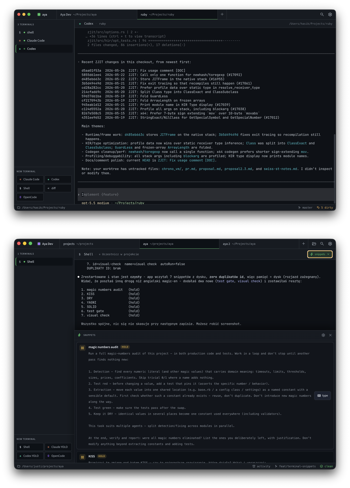

<div align="center">
  
  <h1>Aya</h1>
  <p>
    <strong>A project workspace for coding agents you keep around.</strong><br>
    Long-lived Claude Code, Codex, Aider, and shell sessions, organized by project, in one desktop app.
  </p>
</div>

<p align="center">
  
</p>

<p align="center">
  <a href="https://github.com/khasinski/aya/actions/workflows/build.yml">
    
  </a>
</p>

---

## The shape of it

One Aya window holds many projects. Each project is a directory. Inside each project, the sidebar holds terminals: a `claude`, a `codex`, a plain shell, whatever the work needs. Switch projects with `⌘1..9` and every terminal in every project stays exactly where you left it.

That is the whole product idea. The rest is mechanics.

## What makes it different

Most coding-agent desktop tools right now solve a different problem: spawn N agents in parallel git worktrees and compare their answers. That is a real workflow and tools like Conductor, Crystal/Nimbalyst, Emdash, and CodeAgentSwarm are built for it.

Aya is free, open source, and built for the other workflow:

- You work on several real projects across a day or a week, not several variants of the same task in an hour.
- Each project has one branch you care about, and the agents and shells in that project share it.
- A `claude` session you opened on Monday should still be alive on Wednesday with its full scrollback, because the conversation is part of the work.

That shapes the design:

- **Project-first, not session-first.** Top tabs are projects, sidebar is that project's terminals. The unit of organization is "which repo am I in", not "which task am I parallelizing".
- **No forced worktree model.** Aya does not create, switch, or merge worktrees for you. Open a normal checkout, or open each worktree as its own project if that is how you work.
- **PTYs stay alive across project switches.** Inactive terminals are hidden, not killed. A 4-hour Claude session survives switching to another project, hopping to email, and switching back.
- **Agent-agnostic from day one.** Claude Code, Codex, Aider, Gemini, OpenCode, Amp, Crush, Qwen Code, Kilo Code, and Pi are auto-detected if installed. Any other CLI is one Settings dialog away. Aya treats every harness as a peer.
- **Search across what is actually on screen.** `⇧⇧` or `⌘K` searches project names, terminal names, recent PTY output across every project, and `Run ...` shortcuts. AND semantics, so `ruby codex` finds the Codex terminal in your Ruby project.
- **`aya` from any shell.** `aya` opens the current directory as a project. `aya /path/to/repo` opens that. Already known projects switch in place. The desktop app is the destination, the terminal you are already in is the entry point.

## What you actually do with it

Day to day:

- Type `aya` in any shell to open or switch to a project.
- Open a `claude` tab in one project, a `codex` tab in another, leave both running.
- Split a project into panes when you want Claude Code, Codex, and a shell visible at the same time.
- Keep reusable text snippets (prompts, commands) in a drawer and inject them into the active terminal with one click. They live editor-side in `~/.aya/snippets.json`, not in any agent's context, so they never eat conversation tokens.
- Press `⇧⇧` to jump to either by typing a few characters of the project name or what is on screen.
- See a red dot on the sidebar tab and a macOS dock badge count when an agent is waiting on you. Get an OS notification if the window is not focused.
- See the active project's branch and dirty-file count in the status bar.
- `⌘F` to find inside the active terminal. `Shift+Enter` or `⌥Enter` inserts a newline inside a running rich TUI (claude/codex) instead of submitting; on a cleanly-exited terminal, `Shift+Enter` restarts the PTY in the same pane.
- Import iTerm2 `.itermcolors` or Windows Terminal JSON themes. Per-preset theme overrides if you want Claude green and Codex orange.

## Claude Code, plainly

Aya launches the official `claude` CLI in a normal interactive PTY, the same way Terminal.app or iTerm2 would. It is not a proxy, scraper, shared-account layer, or headless wrapper.

The built-in Claude Code preset is literally `claude`. Aya deliberately does not ship `-p`, `--print`, `--headless`, or other non-interactive flags, and the test suite fails if those flags appear in shipped defaults. Your Claude Code login, plan limits, and Anthropic's terms apply exactly as they do in any other terminal.

The same applies to Codex, Aider, and every other harness. Aya does not insert itself between you and the agent.

## Install

### macOS

Build locally:

```sh
git clone https://github.com/khasinski/aya.git
cd aya
npm install
npm run package
```

Produces:

- `release/mac-arm64/Aya.app`
- `release/Aya-<version>-arm64.dmg`
- `release/Aya-<version>-arm64-mac.zip`

Open the DMG, drag Aya to `/Applications`. Unsigned local builds need a right-click → Open the first time. Signed + notarized builds open normally; see "Signing macOS builds" below.

### Signing macOS builds

The electron-builder config is wired for hardened-runtime + notarization. To produce a signed, notarized DMG:

1. Install a **Developer ID Application** certificate in your login keychain (Apple Developer → Certificates → "+" → Developer ID Application). After install, `security find-identity -v -p codesigning` should show one valid identity.
2. Create an App Store Connect API key at https://appstoreconnect.apple.com/access/integrations/api with "Developer" role. Save the `.p8` file, note the Key ID and Issuer ID.
3. Store the credentials in Keychain once:

   ```sh
   xcrun notarytool store-credentials aya-notarize \
     --key /path/to/AuthKey_XXXXXXXX.p8 \
     --key-id XXXXXXXX \
     --issuer 11111111-2222-3333-4444-555555555555
   ```

4. Build with the keychain profile in the environment:

   ```sh
   APPLE_KEYCHAIN=~/Library/Keychains/login.keychain-db \
   APPLE_KEYCHAIN_PROFILE=aya-notarize \
     npm run package
   ```

   electron-builder picks up the Developer ID identity automatically, signs with the hardened runtime + entitlements in `build/entitlements.mac.plist`, then submits to Apple for notarization and staples the ticket to the DMG.

To produce an **unsigned** local build (no cert needed), prefix with `CSC_IDENTITY_AUTO_DISCOVERY=false`.

### Linux

Build on Linux so `node-pty` is compiled for the target platform. From macOS, use Docker:

```sh
docker run --rm --platform linux/amd64 \
  -v "$PWD":/project \
  -w /project \
  electronuserland/builder:wine \
  /bin/bash -lc 'npm ci && npm test && npx electron-builder --linux AppImage deb --x64'
```

Test artifacts:

- `release/Aya-0.1.0-linux-x64.AppImage`
- `release/aya_0.1.0_amd64.deb`
- `release/linux-unpacked/`

On Ubuntu, prefer the DEB:

```sh
sudo apt install ./aya_0.1.0_amd64.deb
/opt/Aya/aya
```

The DEB installs a desktop launcher. The AppImage can be run directly:

```sh
chmod +x Aya-0.1.0-linux-x64.AppImage
./Aya-0.1.0-linux-x64.AppImage
```

If AppImage complains about FUSE on Ubuntu, use the DEB.

### Development

```sh
npm run dev
```

Launches Vite + `tsc -w` + electronmon. State lives at `~/.aya-dev/` so production builds' data is untouched.

## Keyboard shortcuts

| Shortcut | Action |
|---|---|
| `⌘T` / `Ctrl+T` | New shell tab |
| `⌘W` / `Ctrl+W` | Close active terminal |
| `⌘K` or `⇧⇧` | Search projects / terminals / output |
| `⌘F` / `Ctrl+F` | Find inside the active terminal |
| `⌘[` / `⌘]` | Previous / next terminal in current project |
| `⌘⌥←/→/↑/↓` / `Ctrl+Alt+←/→/↑/↓` | Focus adjacent split pane |
| <code>⌘⌥\\</code> / <code>Ctrl+Alt+\\</code> | Split active pane right |
| `⌘⌥-` / `Ctrl+Alt+-` | Split active pane below |
| `⌘1..9` | Switch to project N |
| `⌘,` / `Ctrl+,` | Settings |
| `Shift+Enter` / `⌥Enter` | Newline inside a running rich TUI (claude/codex) without submitting |
| `Shift+Enter` | Restart a cleanly-exited terminal (in the same pane) |

Right-click a terminal in the sidebar for Restart / Close. Right-click or `×` on a project tab to close it (the JSON stays on disk; restart restores it).

## CLI helper

`bin/aya` opens a directory in the running Aya instance. Symlink it onto PATH:

```sh
ln -s "$PWD/bin/aya" /usr/local/bin/aya
```

Then `aya` opens the current directory as a project, and `aya ~/code/foo` opens that path. If the project exists, Aya switches to it; otherwise it creates one from the directory basename.

When Aya is running, the helper also exposes a small local control surface for agent harnesses:

```sh
aya focus
aya notify --title "Aya" "Needs approval"
aya status set "Running tests"
aya status waiting "Needs approval"
aya status done "Build passed"
aya status error "Tests failed"
aya status clear
```

Terminals launched by Aya receive `AYA_SOCKET`, `AYA_TERMINAL_ID`, `AYA_PROJECT_SLUG`, `AYA_PROJECT_DIR`, and `AYA_PRESET_ID` so these status commands attach to the right pane. The companion skill lives in `skills/aya-control/SKILL.md` and only uses this public CLI side channel; Claude Code, Codex, and other harnesses still run as normal interactive TUIs.

On macOS the helper expects Aya at `/Applications/Aya.app`. On Linux it expects an `aya-app` command on PATH; the DEB installs the binary at `/opt/Aya/aya`, so add an alias if you want the helper workflow:

```sh
sudo ln -s /opt/Aya/aya /usr/local/bin/aya-app
```

## Configuration

Everything lives in `~/.aya/` (or `~/.aya-dev/` in dev):

```
~/.aya/
  projects/<slug>.json       # one per project, hand-editable
  projects-state.json        # top-tab order, open projects, recent projects
  presets.json               # launcher buttons in the sidebar
  snippets.json              # saved text snippets for the injector drawer
  themes.json                # color schemes, xterm.js ITheme shape
  window-state.json          # position, size, fullscreen / maximized
```

Older configs with `projects-order.json` / `open-projects.json` are migrated automatically into `projects-state.json` on launch.

Override the home via `AYA_HOME=/path/to/dir`, useful for screenshots, scratch sessions, or running disjoint configurations.

## How it works

- **Renderer:** React 19 + TypeScript + Vite. xterm.js renders each PTY; inactive terminals stay mounted but hidden, so PTYs survive project switches.
- **Main:** Electron 42. PTYs spawned via `node-pty` under `$SHELL -l -c 'cd CWD && exec CMD'`, with `/bin/bash` as a final fallback. Per-PTY rolling buffer (~200kb) replays on renderer remount so HMR doesn't blank terminals.
- **IPC:** typed contracts in `electron/types.ts`, validated at the boundary in `electron/validation.ts`.
- **Bell heuristic:** strips ANSI escapes from PTY output and matches against known approval-prompt patterns (`Do you want to`, `❯ 1. Yes`, etc.). Imperfect but correct for the common case.
- **Atomic writes:** all config writes go through `.tmp` + rename so a crash mid-write can't truncate state.

## Tests

```sh
npm test
```

Covers launch-safety (no `-p` ever ships in defaults), theme parsers (iTerm2 + Windows Terminal JSON), config / preset normalization, IPC validation, the rolling output buffer, and the harness allow-list.

## CI

GitHub Actions runs tests and a renderer/main build on pull requests and pushes to `main`. Pushes to `main`, version tags (`v*`), and manual workflow runs also package unsigned Linux x64 artifacts.

## Status

Pre-1.0. Dogfooded daily by the author. macOS builds support Developer ID signing + notarization (see "Signing macOS builds"). Linux builds are unsigned local test packages.

## License

MIT, see [LICENSE](LICENSE).
